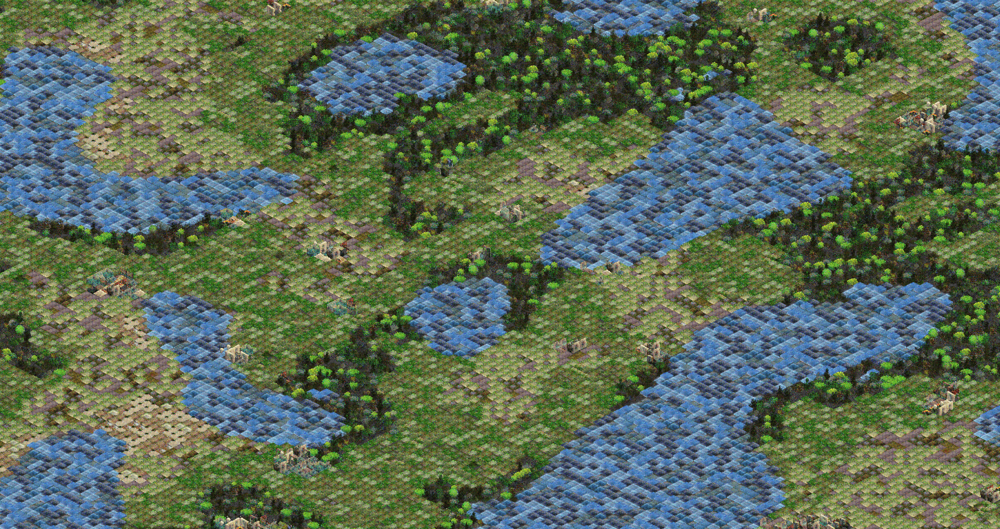

The goal of this project is to make an easy to write format for multi-dimensional and multi-pass procedural terrain generation. The format is easy to write and modify and flexible to use in use cases other than terrain generation. The above image was generated with the following config:


```yaml
steps:
- height*moisture:
  # Base terrain
  - 1@2:rock,1:snow
  - 1@2:grass,3:plants
  - 2@1:sand,2:dirt,2:grass,3:plants
  - 1@2:sand,1:dirt,1:grass,1:plants,2:=water
  - 3@1:=water
  - tile*population:
    # Adding cities
    - sand@9:-,1:buildings
    - grass@2:-,1:buildings
    - dirt,plants@3:-,1:buildings
```

 A full writeup on the format can be found on [my personal blog](https://www.gammagames.net/tutorials/procgen-ruleset) or [Medium](https://medium.com/@gammagames/procedural-generation-ruleset-478a7aeb4c12), I have a little page hosted [here](https://gammagames.github.io/procedural-generation-ruleset/), and you can download a playable demo in the [releases](https://github.com/GammaGames/procedural-generation-ruleset/releases).
